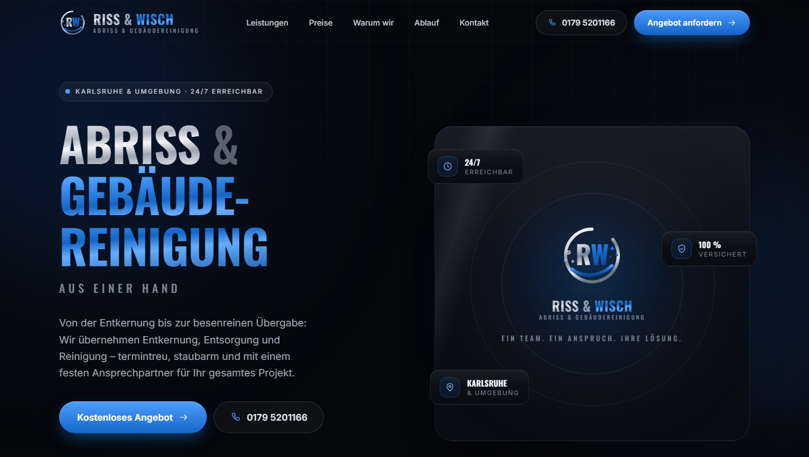
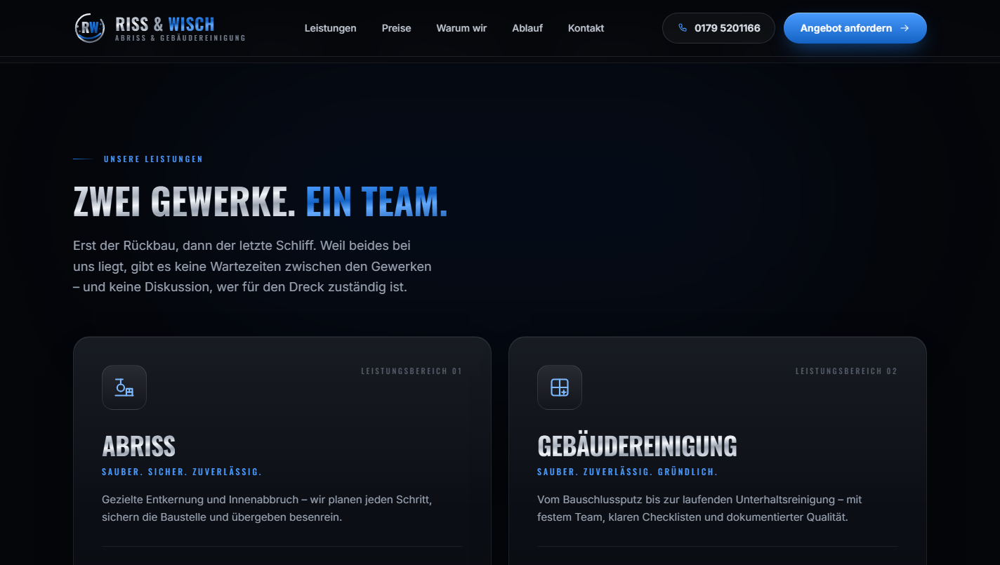
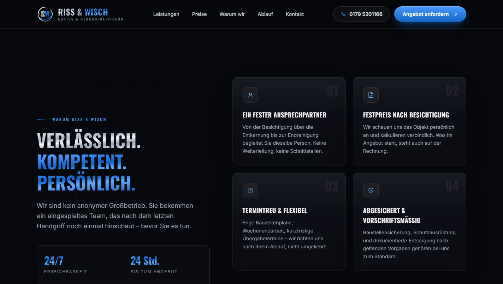
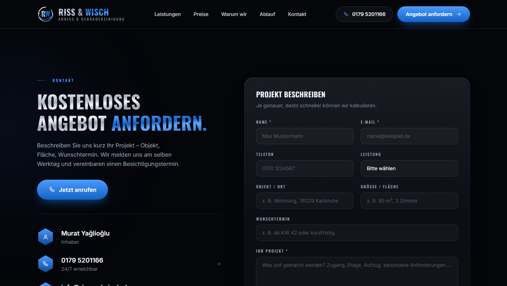
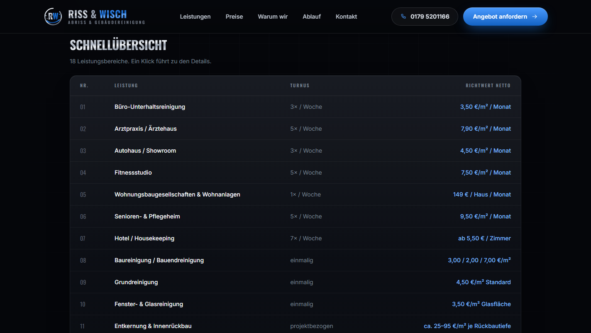

# Riss & Wisch — Website

[](https://nextjs.org)
[](https://www.typescriptlang.org)
[](https://tailwindcss.com)

Landingpage für **Riss & Wisch**, einen Abbruch- und Gebäudereinigungsbetrieb
aus Karlsruhe. Ziel der Seite: aus Besuchern Anfragen machen — mit klarem Leistungsversprechen,
kurzen Wegen zum Kontakt und einem Formular, das die Angaben abfragt, die für eine
Kalkulation wirklich gebraucht werden.



---

## Über das Projekt

Kein Übungsprojekt, sondern die produktive Website eines echten Betriebs. Die visuelle
Sprache ist aus Visitenkarte und Flyer des Unternehmens abgeleitet: Anthrazit-Schwarz,
gebürstetes Silber und Signalblau, Großbuchstaben-Typografie im Industrie-Look.

Der Betrieb bietet zwei Gewerke an, die sonst getrennt eingekauft werden — Abriss und
Reinigung. Genau das ist das Verkaufsargument, und die Seitenstruktur ist darauf gebaut.

## Features

- **Konversionsorientierte Startseite** — Hero mit Doppel-CTA, Leistungen, Vertrauensargumente, 5-Schritte-Ablauf, Kontakt
- **Animierte Hero-Sequenz** in drei Akten (Abrissbirne → Abzieher → Logo) als SVG mit CSS-Keyframes statt Videodatei: wenige Kilobyte, auf jedem Display scharf, kein Autoplay, das mobile Browser blockieren
- **Anfrageformular** mit Feldern für Objekt, Fläche und Wunschtermin, damit Angebote ohne Rückfragen kalkuliert werden können
- **Zwei austauschbare Versandwege** für das Formular (Drittanbieter oder eigenes Postfach) — umschaltbar über eine Zeile
- **Spam-Schutz ohne Captcha** — Honigtopf-Feld, Zeitmessung und serverseitiges Rate-Limit
- **WhatsApp-Sektion** — Kunden schicken Fotos statt einen Vor-Ort-Termin zu vereinbaren
- **Impressum & Datenschutzerklärung** nach § 5 DDG und Art. 13 DSGVO, inklusive Abschnitt zur WhatsApp-Nutzung
- **Keine externen Requests** — Schriften lokal ausgeliefert, keine Cookies, kein Tracking, kein Consent-Banner nötig
- **Preisseite** mit 18 Leistungsbereichen, Schnellübersicht und Ausschlüssen je Bereich
- **SEO** — Metadaten, Open Graph und `LocalBusiness`-Schema mit Adresse und Öffnungszeiten
- **Barrierearm** — Tastaturbedienung, sichtbarer Fokus, `aria`-Auszeichnung, `prefers-reduced-motion` respektiert

## Screenshots

| Leistungen | Warum wir |
|---|---|
|  |  |

| Kontakt & Anfrageformular |
|---|
|  |

| Preisübersicht |
|---|
|  |

## Tech-Stack

| | |
|---|---|
| Framework | Next.js 15 (App Router, React 19) |
| Sprache | TypeScript (strict) |
| Styling | Tailwind CSS 4 mit eigenem Theme-Layer |
| Schriften | Oswald & Inter über `next/font` (selbst gehostet) |
| Mailversand | FormSubmit **oder** Nodemailer über eigenes SMTP-Postfach |
| Grafiken | Inline-SVG (Logo und Icons), keine Bilddateien |
| Hosting | Vercel |

## Projektstruktur

```
src/
├── app/
│   ├── api/anfrage/route.ts    Formular-Endpunkt (Validierung, Spam-Schutz, Versand)
│   ├── datenschutz/            Datenschutzerklärung, passt sich dem Versandweg an
│   ├── impressum/
│   ├── globals.css             Theme-Variablen, Komponentenklassen, Animationen
│   ├── layout.tsx              Schriften, Metadaten, Header/Footer
│   └── page.tsx                Startseite inkl. JSON-LD
├── components/                 Hero, Services, Advantages, Process, Contact, …
└── lib/
    ├── mail.ts                 Versandlogik inkl. Anbieter-Presets
    └── site.ts                 Stammdaten, Navigation, Konfiguration
scripts/
├── mail-setup.mjs              Interaktive Einrichtung des Mailversands
└── mail-test.mjs               Verbindungs- und Versandtest
```

## Lokal starten

```bash
npm install
```

```bash
npm run dev
```

Die Seite läuft dann auf <http://localhost:3000>.

> **Hinweis:** `npm run build` nicht starten, während `npm run dev` läuft — beide schreiben
> in denselben `.next`-Ordner und der Dev-Server verliert dabei seine Chunks.

## Kontaktformular konfigurieren

Der Versandweg wird in [`src/lib/site.ts`](src/lib/site.ts) gewählt:

```ts
export const contactForm = {
  provider: "formsubmit", // oder "eigener"
  formsubmitCode: "info@rissundwisch.de",
};
```

| | `"formsubmit"` | `"eigener"` |
|---|---|---|
| Einrichtung | keine — Adresse einmalig bestätigen | `npm run mail:setup` |
| Serverbedarf | keiner | Next.js Route Handler |
| Zugangsdaten | keine | SMTP im lokalen `.env.local` |
| Datenfluss | über einen Drittanbieter | direkt ins eigene Postfach |

Die Datenschutzerklärung reagiert auf diese Einstellung und beschreibt jeweils den
tatsächlich genutzten Weg — die Rechtstexte können also nicht auseinanderlaufen.

Für den eigenen Versand:

```bash
npm run mail:setup
```

Der Assistent fragt Anbieter, Adresse und Passwort ab, schreibt `.env.local` und verschickt
sofort eine Testmail. Presets für IONOS, Strato, Hetzner, mailbox.org, united-domains,
domainfactory, Microsoft 365, Gmail, GMX und WEB.DE sind hinterlegt; Host und Port muss
niemand nachschlagen. Prüfen lässt sich die Konfiguration jederzeit mit:

```bash
npm run mail:test
```

## Deployment

Das Projekt ist für Vercel gebaut: Repository importieren, Framework wird automatisch
erkannt, deployen. Beim Verbinden der eigenen Domain nur A- und CNAME-Record beim
Registrar setzen — **nicht** die Nameserver umstellen, sonst verschwinden die MX-Einträge
und die geschäftliche E-Mail fällt aus.

## Design- und Technikentscheidungen

Ein paar Punkte, die im Code nicht sofort sichtbar sind:

- **Eigene CSS-Klassen liegen in `@layer components`.** Ohne diese Schicht gewinnt eigenes
  CSS gegen Tailwind-Utilities — die Folge war ein Mobile-Menü-Button, den `md:hidden`
  nicht mehr ausblenden konnte.
- **Scroll-Animationen sind Progressive Enhancement.** Der versteckte Startzustand wird
  erst aktiv, wenn das Skript läuft. Ohne JavaScript ist die Seite vollständig sichtbar,
  statt leer zu bleiben.
- **Zeilenabstand statt engster Typografie.** Versal-Umlaute (Ä, Ö) brauchen mehr Höhe als
  normale Großbuchstaben; bei `leading` unter 1 stoßen ihre Punkte in die Zeile darüber.
- **Keine Bilddateien für Logo und Icons.** Alles ist Inline-SVG mit Verläufen — dadurch
  auf jedem Display scharf und ohne zusätzliche Requests.
- **Schriften lokal.** Google Fonts über CDN einzubinden ist in Deutschland ein bekannter
  Abmahngrund; `next/font` liefert sie vom eigenen Server aus.
- **Hero-Animation ohne Video.** Alle Teile hängen an derselben 12-Sekunden-Schleife und
  werden über Prozentwerte getaktet, damit nichts auseinanderläuft. Zwei Fallstricke
  stecken darin: ein Verlauf mit `objectBoundingBox` wird auf exakt senkrechten Linien
  nicht gezeichnet, und in SVG zeigt die y-Achse nach unten — ein positiver Drehwinkel
  schwingt deshalb nach links.
- **Validierung an beiden Enden.** Client und Server prüfen nach denselben Regeln, damit
  beide Versandwege sich identisch verhalten.

## Rechtliches

Der Code dieses Projekts sowie Inhalte, Logo und Marke gehören dem Inhaber von
Riss & Wisch. Veröffentlichung als Referenzprojekt — keine Lizenz zur Weiterverwendung.

Die Rechtsform ist in [`src/lib/site.ts`](src/lib/site.ts) hinterlegt (`legal.rechtsform`).
Impressum und Datenschutzerklärung passen sich an: Register- und Umsatzsteuerangaben
erscheinen nur, wenn sie gesetzt sind — § 5 DDG verlangt sie nur, soweit vorhanden.
